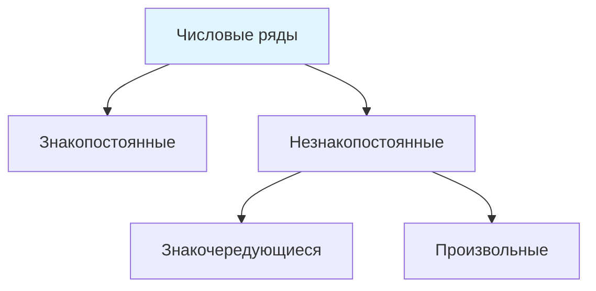

Пусть {$a_n$} - числовая последовательность
$S_1 = a_1, S_2 = a_1 + a_2, S_3 = a_1 + a_2 + a_3$
$S_k = a_1+...+a_k$
{$S_k$ } - последовательность частичных сумм
Числовой ряд:
$$\sum_{n = 1}^\infty a_n$$ $a_n$ - общий член ряда

---
Числовой ряд $\sum_{n = 1}^\infty a_n$ называется сходящимся, если $\exists\ конечный\ lim_{k \to \infty}S_k = S,\ тогда\ S = \sum_{n = 1}^\infty a_n$
## **$\boxed{Th}$ Необходимое условие сходимости числового ряда*
Если числовой ряд $\sum_{n = 1}^\infty a_n$ сходится, то $lim_{n \to \infty} a_n = 0$
Следствие 
$lim_{n \to \infty}a_n \neq 0 \implies \sum_{n = 1}^\infty a_n$  - расходящийся

---
## Классификация числовых рядов
**Формулы:**
- Знакопостоянные: $a_n \geq 0$
- Знакочередующиеся: $\sum (-1)^n a_n$, где $a_n \geq 0$
- Произвольные, пример $sin(n)$

**Схема классификации:**

## Признаки сходимости знакопостоянных числовых рядов
$$\sum_{n = 1}^\infty a_n\ , a_n \geq 0$$
1) **Признак Даламбера** 
Пусть $lim_{n \to \infty}\frac{a_{n+1}}{a_n} = q$
Если $q < 1$ ряд сходится
Если $q > 1$ ряд расходится
Если $q = 1$ признак не работает
2) Радикальный признак Коши для всех рядов
Пусть $lim_{n \to \infty} \sqrt[n]{a_n} = q$
Если  $q < 1$ ряд сходится
Если $q > 1$ ряд расходится
Если $q = 1$ признак не работает, но если последовательность стремится к своему пределу $q$ сверху, то ряд сходится.
### *Th Критерий Коши сходимости числовых рядов*

Числовой ряд $$\sum_{n = 1}^\infty a_n \ сходится\iff\forall\ \varepsilon > 0\  \exists\ N \in \mathbb{N} :\forall\ m > k> N |\sum_{n = k}^m a_n| < \varepsilon $$
Отрицание Критерий Коши сходимости числовых рядов
$$\sum_{n = 1}^\infty a_n \ расходится\iff\exists\ \varepsilon > 0\  \forall\ N \in \mathbb{N} :\exists\ m > k> N |\sum_{n = k}^m a_n| \geq \varepsilon$$
**Утверждение 1**
Гармонический ряд расходится
$$\sum_{n = 1}^\infty \frac{1}{n}\ - \ гармонический\ ряд$$

### *Th $I$ признак сравнения*
Пусть $$\exists\ N \in \mathbb{N} : \forall\ n > N :a_n \leq b_n$$
Тогда если $\sum_{n = 1}^\infty b_n$ сходится, то  $\sum_{n = 1}^\infty a_n$ сходится
Если $\sum_{n = 1}^\infty a_n$ расходится, то $\sum_{n = 1}^\infty b_n$ расходится
### *Th Интегральный признак*
$$\forall\ n \in \mathbb{N}\ a_n \geq 0,\ lim_{n \to \infty}a_n = 0,\ тогда \sum_{n = 1}^\infty a_n\ и \int_1^{+\infty} a_n dn\ сходится\ и \ расходится\ одновременно$$

### *Th $II$ второй признак сравнения*
Пусть $a_n\sim b_n, \ n \rightarrow \infty$
То есть $lim_{n \to \infty}\frac{a_n}{b_n} = 1,\ тогда\ \sum_{n = 1}^\infty a_n \ и\ \sum_{n = 1}^\infty b_n$ сходится и расходится одновременно

## Знакочередующиеся ряды
**Опр1** 
$\sum_{n = 1}^\infty a_n$ сходится абсолютно, если $\sum_{n = 1}^\infty |a_n|$ сходится
**Опр2** 
Если $\sum_{n = 1}^\infty |a_n|$ расходится, то $\sum_{n = 1}^\infty a_n$ сходится условно 
### *Th Признак Лейбница сходимости знакочередующихся числовых рядов*
Пусть $$\sum_{n = 1}^\infty (-1)^n*a_n,\ такой\ что\ a_n\geq 0$$
А также для него выполняются условия:
1) {$a_n$} - монотонна
2) $lim_{n \to \infty}a_n = 0$
Тогда $$\sum_{n = 1}^\infty (-1)^n*a_n\ - сходится$$
Способы проверки монотонности
- $a_n'$  < 0 $\implies$ монотонно убывает
- $a_{n+1} < a_n$ монотонно убывает
### *Th О Связи абсолютной сходимости и обычной сходимости*
Если числовой ряд сходится абсолютно, то он сходится
